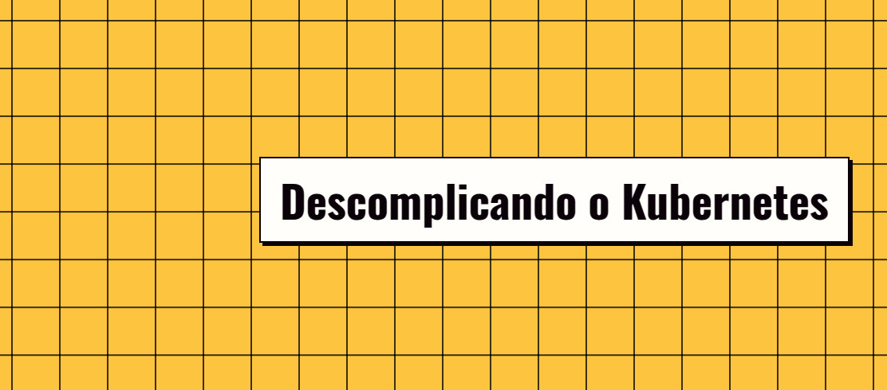

  

Arquivos, anotações sobre as aulas e leituras complementares do curso Descomplicando o Kubernetes da LinuxTips.

> Disclaimer: esse repositório ainda está em construção e, portanto, pode ser reestruturado a qualquer momento.

## Ferramentas Utilizadas

- [kind](https://kind.sigs.k8s.io/)
- [kubectl](https://kubernetes.io/docs/tasks/tools/)

## Anotações sobre Teoria

As anotações sobre teoria foram feitas baseadas, tanto na referência principal, o curso, quanto nas referências secundárias, os textos e leituras complementares. Elas estão condençadas na pasta [/notes](./notes).

## Anotações sobre Prática

As anotações sobre a prática, utilizando o `kind` e `kubectl`, por sua vez, estão nos arquivos `README.md` dentro de cada pasta `day-x` na pasta [/training](./training). Essa estrutura foi feita dessa forma, pensando na estrutura do curso: separado por dias.

## Referências

As referências estão divididas entre a principal, que foi o curso, utilizado como base e cronograma para o aprendizado, e secundárias, que foram utilizadas como leitura complementar.

### Principal

- [Descomplicando o Kubernetes](https://linuxtips.io/treinamento/descomplicando-o-kubernetes/)

### Secundárias

- [Leandro Proença - Thinking like containers](https://dev.to/leandronsp/thinking-like-containers-3k24)
- [Leandro Proença - Kubernetes 101, part I, the fundamentals](https://dev.to/leandronsp/kubernetes-101-part-i-the-fundamentals-23a1)
