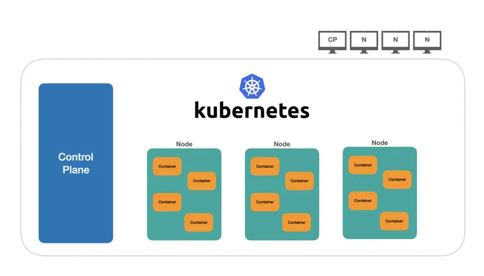

# Nodes

Podemos considerar uma quantidade de máquinas (ou máquinas virtuais), sendo uma delas chamada de `Control Plane` onde o `cluster` é criado e é responsável por aceitar novas máquinas (nós/nodes) que contém os containers gerenciados pelo cluster. Todos os containers em execução estabelecem o que é chamado de estado do cluster.

[Kuberneter 101 - Fundamentals](https://dev.to/leandronsp/kubernetes-101-part-i-the-fundamentals-23a1)
