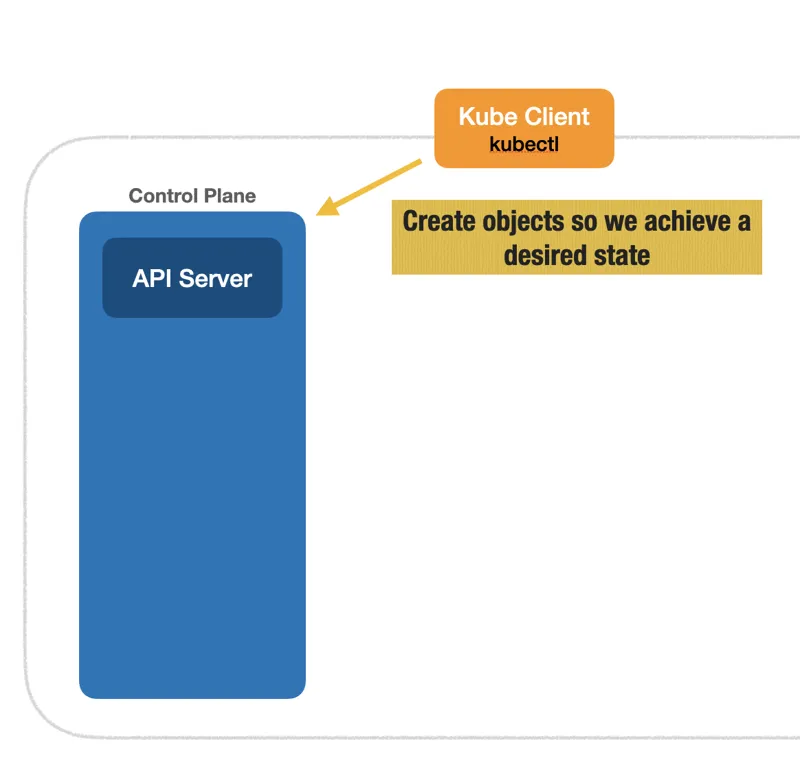

# kubectl e API Server

No Kubernetes, declaramos o estado desejado fazendo uma solicitação HTTP para a API do Kubernetes e ele trabalhará para atingir o estado desejado.

O `kubectl` é um CLI que cuida da parte de autenticação e faz as requisições HTTP para alterar o estado do cluster. O fluxo de iterações com o `kubectl` e o `Control Plane` pode ser descrito pela imagem abaixo:

[Kuberneter 101 - Fundamentals](https://dev.to/leandronsp/kubernetes-101-part-i-the-fundamentals-23a1)
