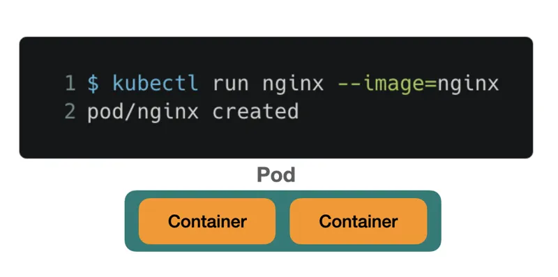

# Pod

Um `pod` é a menor unidade de objeto que podemos interagir no Kubernetes. Um `pod` pode ser pensado como se fosse um container, só que um pod pode conter vários containers.

[Kuberneter 101 - Fundamentals](https://dev.to/leandronsp/kubernetes-101-part-i-the-fundamentals-23a1)
