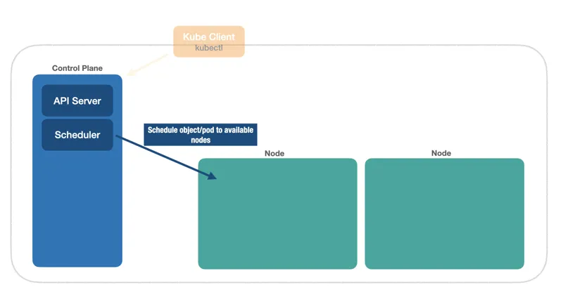

# Control Plane Scheduler

O `Control Plane Scheduler` escolhe o próximo nó (`node`) disponível e agenda o `objeto`/`pod` para que seja executado nele.

[Kuberneter 101 - Fundamentals](https://dev.to/leandronsp/kubernetes-101-part-i-the-fundamentals-23a1)
