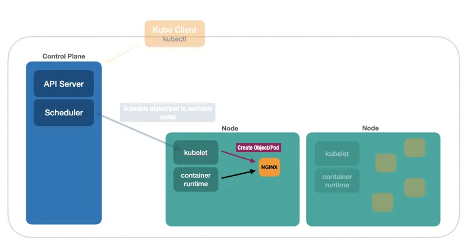

# Node Kubelet

Cada nó contém um componente chamado de `kubelet` que admite os objetos vindo do `Scheduler` e usando o `container runtime` instalado no nó cria o objeto dentro do nó.

[Kuberneter 101 - Fundamentals](https://dev.to/leandronsp/kubernetes-101-part-i-the-fundamentals-23a1)
