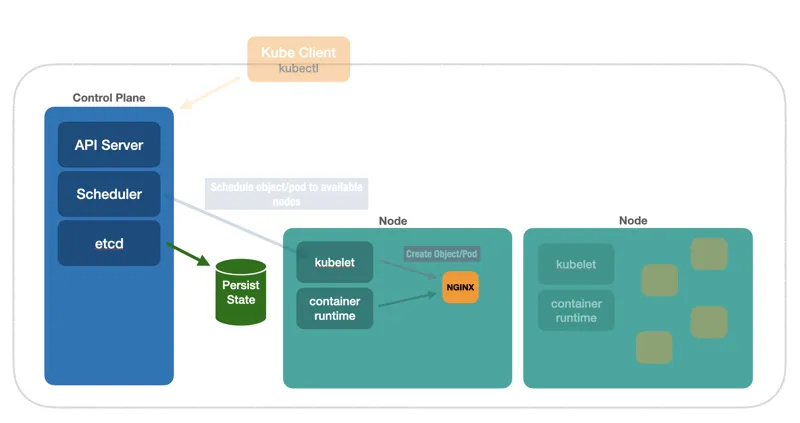

# etcd

No `Control Plane` existe um componente chamado `etcd` que é um banco de dados `chave-valor` distribuído. O Kubernetes usa o `etcd` para armazenar o estado atual.

[Kuberneter 101 - Fundamentals](https://dev.to/leandronsp/kubernetes-101-part-i-the-fundamentals-23a1)
