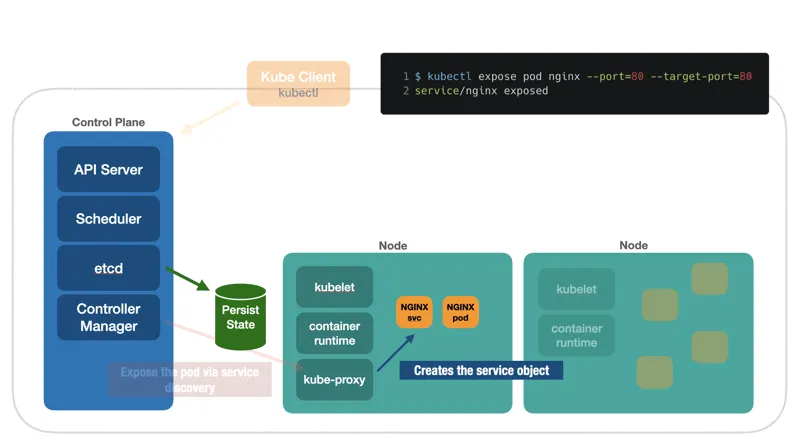

# Controller Manager

O `Control Plane` disponibiliza um componente chamado de `Controller Manager` que é responsável por receber uma requisição por objetos especiais como os `Services` e expor eles via `service discovery`. O roteamento é feito em um componente, que roda no `Node` chamado de `kube-proxy`.

[Kuberneter 101 - Fundamentals](https://dev.to/leandronsp/kubernetes-101-part-i-the-fundamentals-23a1)
