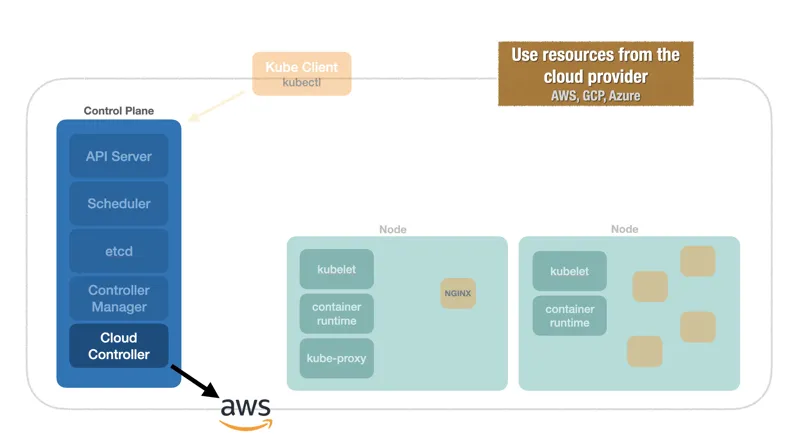
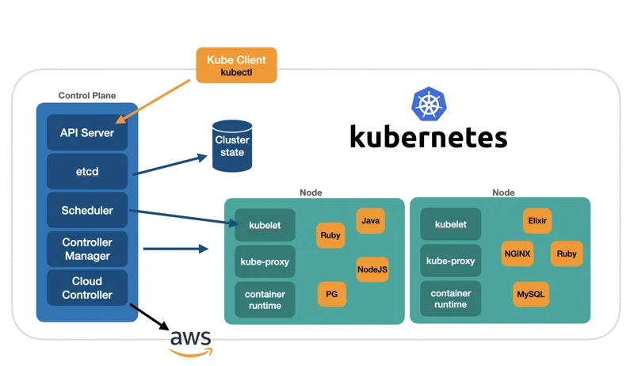

# Cloud Controller

Outro componente que existe no `control plane` é o `Cloud Controller` responsável por receber requisições para criar objetos e interagir com algum provedor de nuvem. Por exemplo, ao criar um `LoadBalancer`, o `Cloud Controller` vai criar um `LoadBalancer` na cloud provider, como a `AWS`, `GCP`, `Azure`, etc.

[Kuberneter 101 - Fundamentals](https://dev.to/leandronsp/kubernetes-101-part-i-the-fundamentals-23a1)
